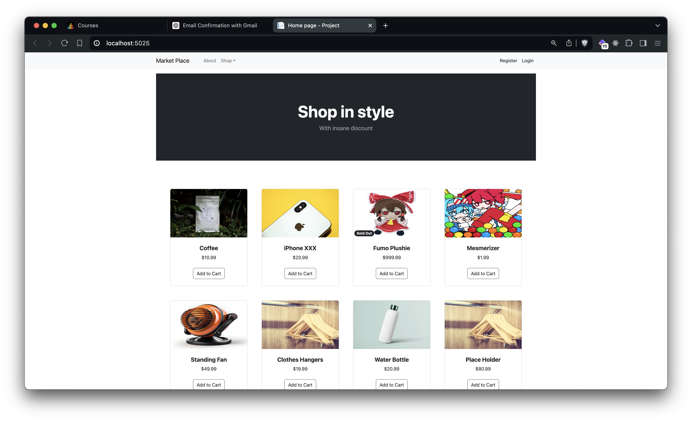
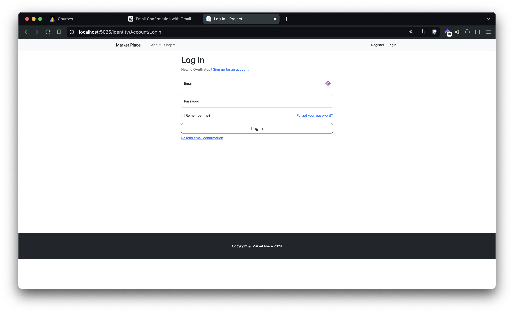
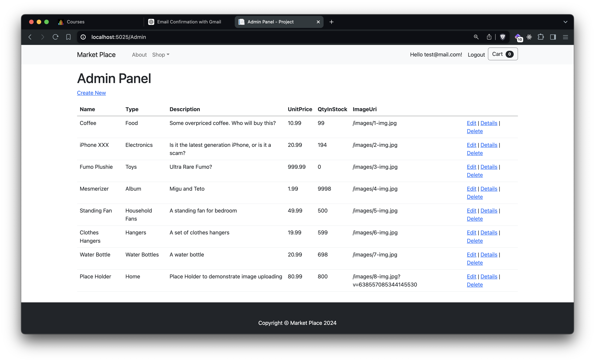

# Market Place

A sample market place implemented in razor pages.

## Screenshots





## Feature

- Login/Logout
- Email Confirmation
- Add Product to Cart
- Checkout
- Admin Panel to edit products

## Dependencies

If you have not installed entity framework core tools yet, consult the official documentation to install and config the path correctly.

[Install Entity Framework Core tools](https://learn.microsoft.com/en-us/ef/core/cli/dotnet#installing-the-tools)

### Project dependencies

```bash
dotnet restore
```

## Development

### Init secret manager

```bash
dotnet user-secrets init
```

### Config the secrets for your SMTP

```bash
dotnet user-secrets set "EmailSettings:Email" "your-email@gmail.com"
dotnet user-secrets set "EmailSettings:DisplayName" "Your Display Name"
dotnet user-secrets set "EmailSettings:Password" "your-app-password"
dotnet user-secrets set "EmailSettings:Host" "smtp.gmail.com"
dotnet user-secrets set "EmailSettings:Port" "587"
```

### Migrate to latatest database

```bash
dotnet ef database update
```

### Start development

```bash
dotnet watch
```
